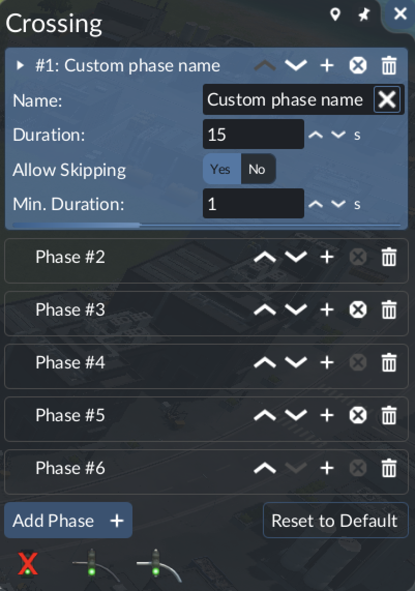

# Traffic Light UI enhancer

A Transport Fever 3 mod that improves the traffic light phase editor at crossings.

## Features

- **Reorder phases:** move a phase up or down instead of deleting and re-adding it.
- **Insert below:** add a new phase (all lanes red) directly below any existing phase.
- **Rename phases:** custom names are shown in the phase list (`#1: My name`).
- **Exact durations:** Duration and Min. Duration use whole-number inputs with +1/-1 buttons instead of sliders.
  Min. Duration is capped at the phase duration and only editable when skipping is allowed.

## Known limitations

- **Phase names are lost when the mod is removed.** Names are stored in the savegame by the mod's game script.
  Loading a save without the mod drops that state (`Removing entity … for GameScript …/phase_names.gs which is no
  longer available` in `stdout.txt`); re-adding the mod does not bring the names back. Phase order, durations and
  all other settings are stored in the game's own traffic light data and stay intact.

## Installation

- **mod.io:** subscribe in the in-game mod browser.
- **Local:** copy `src/traffic_light_ui_enhancement` to the mod directory of the game and enable the mod.

## How it works

- `ui_enhancement.res.lua` registers a `react-replacement-config` that replaces the base
  `DoubleSlipSwitchContent` recipe (`::/gui/entity_window/double_slip_switch.tl`).
- `ui_enhancement.script.tl` is a fork of the base `TrafficLightConfigWidget`, registered as
  `TlueTrafficLightConfigWidget`. Changes to the base code are marked with `traffic_light_ui_enhancement:`.
  Phase edits are committed through the game's traffic light proposal, like the original widget.
- `ui_enhancement.css.lua` copies the base widget's style rules retargeted to the forked recipe name
  (stylesheets select by recipe name, so the fork gets no base styling otherwise).
  The base descendant selectors `!state-box BoxLayout` / `!state-box R::Component` are replaced with explicit
  classes (`tlue-card`, `tlue-card-layout`, `tlue-row`): applied at any depth, they reach into
  `TextInputField` internals and clip the input text.
- `phase_names.gs.lua` / `phase_names.script.tl` is a game script that stores phase names per node
  (event `tlueSetNames`); the GUI reads its state via `gameScriptSystem.getEntityForGameScript`.
